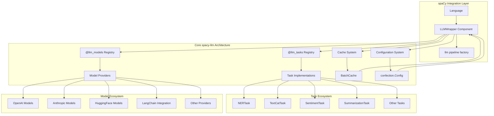

## Project Overview
The `spacy-llm` project integrates Large Language Models (LLMs) into [spaCy](https://spacy.io) natural language processing pipelines . Its main goal is to enable structured NLP tasks using LLM prompting without requiring training data, while maintaining compatibility with spaCy's ecosystem and performance optimizations . This allows for fast prototyping and turning unstructured LLM responses into robust outputs for various NLP tasks . The target audience includes developers and researchers who want to leverage LLMs within spaCy pipelines for tasks like Named Entity Recognition, Text Classification, and Summarization .

## Architecture & Structure
### High-level architecture overview
`spacy-llm` operates as a modular extension to spaCy, providing the `LLMWrapper` pipeline component . This component orchestrates prompt generation, LLM execution, and response parsing through a registry-based configuration system . The system implements a clean separation between task logic (prompt generation and response parsing) and model execution .




### Key directories and their purposes
While specific directory purposes are not explicitly detailed in the provided snippets, the `spacy_llm` directory likely contains the core source code . The `usage_examples` directory contains examples of how to use `spacy-llm` for common NLP tasks . The `.github/workflows` directory contains GitHub Actions workflow definitions for CI/CD .

### Main components and how they interact
The main components are the `LLMWrapper` component, `LLMTask` implementations, and `PromptExecutorType` models .
- `LLMWrapper` (`spacy_llm/pipeline/llm.py:98-170`): This is a spaCy pipeline component that manages the execution of prompts to LLM APIs and maps responses back to `Doc`/`Span` instances . It takes a `task`, `model`, and `cache` as arguments during initialization .
- `LLMTask`: An `LLMTask` is responsible for generating prompts from `Doc` objects and parsing the LLM's responses back into structured information on the `Doc` . Examples include `SentimentTask` . Tasks implement `generate_prompts` and `parse_responses` methods .
- `PromptExecutorType` (Model): This is a callable that queries the specified LLM API . Models are responsible for executing the prompts generated by the task . An example is the `LangChain` model .

The interaction flow is: `LLMWrapper` calls `task.generate_prompts` to get prompts, then `model.execute` to send prompts to the LLM, and finally `task.parse_responses` to process the LLM's output and update the `Doc` object .

### Data flow and system design
The data flow involves spaCy `Doc` objects being processed by the `LLMWrapper` . The `LLMTask` generates prompts from these `Doc` objects , which are then sent to the `PromptExecutorType` (model) . The model returns responses, which the `LLMTask` parses and uses to update the original `Doc` objects . The system also includes a caching mechanism (`BatchCache`) to optimize performance .

## Development Setup
### Prerequisites and dependencies
`spacy-llm` requires `spacy>=3.5,<4.0` and `confection>=0.1.3,<1.0.0` . Optional dependencies like `langchain` and `transformers` enable additional model integrations . Python 3.9 or newer is required .

### Installation steps
To install `spacy-llm`, you can use pip: `python -m pip install spacy-llm` . It's recommended to install it in the same virtual environment where spaCy is already installed .

### Environment configuration
API keys for external LLM providers like OpenAI, Anthropic, and Cohere need to be set as environment variables . For example, `OPENAI_API_KEY` for OpenAI models .

### How to run the project locally
You can run `spacy-llm` locally by creating a spaCy pipeline with the `llm` component .
For quick experiments, you can add the `llm_textcat` pipe directly in Python code:
```python
import spacy

nlp = spacy.blank("en")
llm = nlp.add_pipe("llm_textcat")
llm.add_label("INSULT")
llm.add_label("COMPLIMENT")
doc = nlp("You look gorgeous!")
print(doc.cats)
```

For more control, you can use a configuration file (`config.cfg`) and load it with `spacy_llm.util.assemble` :
```python
from spacy_llm.util import assemble

nlp = assemble("config.cfg")
doc = nlp("You look gorgeous!")
print(doc.cats)
```


## Code Organization
### Coding standards and conventions
The project uses `black` for code formatting , `ruff` for linting , and `isort` for import sorting . `mypy` is used for static type checking . These tools are enforced via pre-commit hooks .

### File naming patterns
Not explicitly detailed in snippets, but Python modules generally follow `snake_case`.

### Import/export patterns
The project uses spaCy's registry system for registering tasks and models . Components are registered using decorators like `@registry.llm_tasks` and `@registry.llm_models`  .

### Component structure
The core component `LLMWrapper` is a spaCy `Pipe` . Tasks are typically implemented as classes inheriting from `BuiltinTask`  and registered via factory functions . Models are often callable functions or classes that implement the `PromptExecutorType` interface .

## Key Features & Implementation
### Main features and how they're implemented
- **Serializable `llm` component**: Integrates prompts into spaCy pipelines . Implemented by the `LLMWrapper` class .
- **Modular tasks and models**: Defines how prompts are structured/parsed (`task`) and which model to use (`model`) . Tasks implement `generate_prompts` and `parse_responses` . Models are callables that execute prompts .
- **Multi-provider model support**: Interfaces with OpenAI, Cohere, Anthropic, Google PaLM, Azure AI, and Hugging Face models . This is achieved through various model implementations registered under `@llm_models` .
- **LangChain integration**: Allows using all `langchain` models and features . Implemented by the `LangChain` class and its `_langchain_model_maker` factory .
- **Built-in tasks**: Provides tasks like NER, Text Classification, Summarization, etc. . These are implemented as classes inheriting from `BuiltinTask` .
- **Map-reduce approach for long prompts**: Splits prompts exceeding LLM context windows and fuses results . This is handled by `shard_mapper` and `shard_reducer` functions within `BuiltinTask` .

### Important algorithms or business logic
- **Prompt generation**: Tasks use Jinja2 templates to render prompts from `Doc` objects and few-shot examples .
- **Response parsing**: Each task defines its own `parse_responses` method to convert raw LLM output into structured spaCy `Doc` attributes . For example, `SentimentTask` sets a `sentiment` custom extension on the `Doc` <cite repo="explosion/spacy

# Development Partnership and How We Should Partner

We build production code together. I handle implementation details while you guide architecture and catch complexity early.

## Core Workflow: Research → Plan → Implement → Validate

**Start every feature with:** "Let me research the codebase and create a plan before implementing."

1. **Research** - Understand existing patterns and architecture
2. **Plan** - Propose approach and verify with you
3. **Implement** - Build with tests and error handling
4. **Validate** - ALWAYS run formatters, linters, and tests after implementation

## Code Organization

**Keep functions small and focused:**
- If you need comments to explain sections, split into functions
- Group related functionality into clear packages
- Prefer many small files over few large ones

## Architecture Principles

**This is always a feature branch:**
- Delete old code completely - no deprecation needed
- No "removed code" or "added this line" comments - just do it

**Prefer explicit over implicit:**
- Clear function names over clever abstractions
- Obvious data flow over hidden magic
- Direct dependencies over service locators

## Maximize Efficiency

**Parallel operations:** Run multiple searches, reads, and greps in single messages
**Multiple agents:** Split complex tasks - one for tests, one for implementation
**Batch similar work:** Group related file edits together

## Problem Solving

**When stuck:** Stop. The simple solution is usually correct.

**When uncertain:** "Let me ultrathink about this architecture."

**When choosing:** "I see approach A (simple) vs B (flexible). Which do you prefer?"

Your redirects prevent over-engineering. When uncertain about implementation, stop and ask for guidance.

## Testing Strategy

**Match testing approach to code complexity:**
- Complex business logic: Write tests first (TDD)
- Simple CRUD operations: Write code first, then tests
- Hot paths: Add benchmarks after implementation

**Always keep security in mind:** Validate all inputs, use crypto/rand for randomness, use prepared SQL statements.

**Performance rule:** Measure before optimizing. No guessing.

## Progress Tracking

- **Use Todo lists** for task management
- **Clear naming** in all code

Focus on maintainable solutions over clever abstractions.

---
Generated using [Sidekick Dev]({REPO_URL}), your coding agent sidekick.
